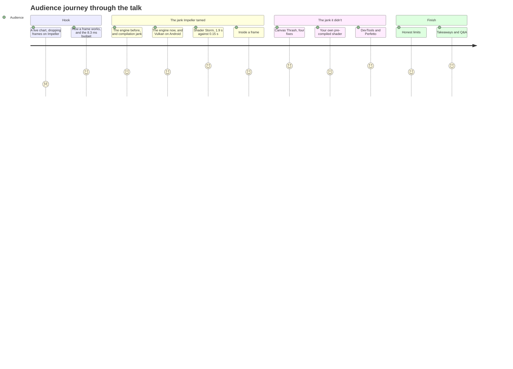
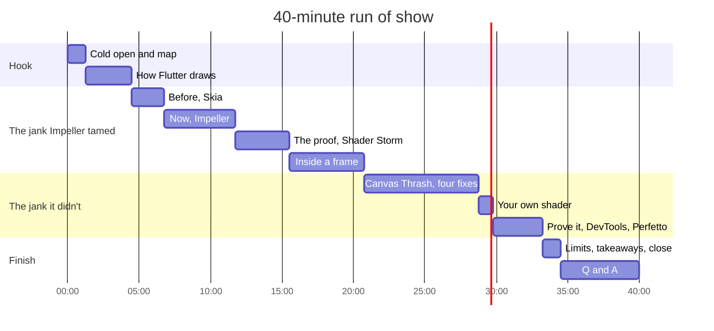

# Talk outline

**Beyond Skia: Deep-Dive GPU Scheduling and Profiling with Impeller on Android 10+**
40 minutes · demos on a mirrored 120 Hz Android phone, with recordings as fallback, real traces · mixed Flutter, Kotlin and iOS audience

## Core message

> Impeller made performance **predictable**. It didn't make expensive work free.

## Three takeaways (as registered)

These match the registered abstract word for word in their titles. Every promise in the
abstract is traced to a demo line in [Abstract alignment](abstract-alignment.md).

1. **Demystifying the Engine.** Skia compiled shaders just in time, during frames. Impeller
   compiles them ahead of time, builds Vulkan pipelines from them, tessellates paths into
   triangles on the CPU and records explicit command buffers.
2. **Low-Level Profiling.** Read the frame budget as about 4 ms UI and 4 ms raster at
   120 Hz. Which thread is over? Which event? Which code? DevTools Timeline for the frame,
   Systrace/Perfetto for the system.
3. **Taming Custom Painters.** Use the precompiled pathways (one `drawVertices`, a gradient
   fill instead of a blurred layer), isolate repaints precisely, reduce layer complexity, and avoid
   `saveLayer()`. Prove every fix with numbers.

## Narrative arc

```mermaid
journey
    title Audience journey through the talk
    section Hook
      A live chart, dropping frames on Impeller: 2: Audience
      How a frame works, and the 8.3 ms budget: 4: Audience
    section The jank Impeller tamed
      The engine before, and compilation jank: 4: Audience
      The engine now, and Vulkan on Android: 4: Audience
      Shader Storm, 1.9 s against 0.15 s: 5: Audience
      Inside a frame: 4: Audience
    section The jank it didn't
      Canvas Thrash, four fixes: 5: Audience
      Your own pre-compiled shader: 4: Audience
      DevTools and Perfetto: 5: Audience
    section Finish
      Honest limits: 4: Audience
      Takeaways and Q&A: 5: Audience
```

## Time plan

Estimates from the [Demo script](demo-script.md#run-of-show). Check them in a rehearsal.

```mermaid
gantt
    title 40-minute run of show
    dateFormat mm:ss
    axisFormat %M:%S
    section Hook
    Cold open and map             :h1, 00:00, 75s
    How Flutter draws             :h2, after h1, 195s
    section The jank Impeller tamed
    Before, Skia                  :a1, after h2, 135s
    Now, Impeller                 :a2, after a1, 300s
    The proof, Shader Storm       :a3, after a2, 225s
    Inside a frame                :a4, after a3, 315s
    section The jank it didn't
    Canvas Thrash, four fixes     :b1, after a4, 480s
    Your own shader               :b2, after b1, 60s
    Prove it, DevTools, Perfetto  :b3, after b2, 210s
    section Finish
    Limits, takeaways, close      :f1, after b3, 75s
    Q and A                       :f2, after f1, 330s
```

The line-by-line version is the [Demo script](demo-script.md). If time runs short, follow the cuts in the [Stage runbook](stage-runbook.md#timing-cues).

## Slide list

| # | Slide | Point | Demo |
|---|---|---|---|
| 1 | Beyond Skia | Cover | Live: chart at 8× |
| 2 | Impeller tamed one kind of jank. | The map: compilation jank and drawing cost |  |
| 3 | One frame, from vsync to pixels. | Dart and the engine; records, prepares, executes |  |
| 4 | Every frame gets 8.3 ms. | A train every 8.3 ms; about 4 + 4 ms target; real broken frames | Concept video after |
| 5 | Compilation jank. | Skia on OpenGL ES; 118 shaders in one 1.8 s frame |  |
| 6 | The Android engine, before and now. | One table: what's compiled ahead, Dart's thread, raster work, raster cache, GPU API |  |
| 7 | Skia compiles late. Impeller compiles early. | The recipe and the kitchen; JIT against AOT |  |
| 8 | On Android, Vulkan isn’t guaranteed. | The rollout; Android 10 is the minimum; the device checks; read the log |  |
| 9 | Same app. Same phone. Two renderers. | 1,863 against 145 ms; 23 against 48 ms; 13× shorter, and it barely grows | Live: Shader Storm; vote |
| 10 | The cost shrank and moved. It didn’t vanish. | 118 shaders against 40 pipelines, to scale |  |
| 11 | Tessellation: how a path becomes triangles. | Path to triangles; the app's real X-ray lens; at least 256,000 vertices |  |
| 12 | The CPU records. The GPU executes. | The waiter and the kitchen; from `drawCircle` to a command buffer |  |
| 13 | Overdraw: painting the same pixel again. | Painting a wall three times; `Stack` code; not measured in the demo |  |
| 14 | Why a layer costs more than a draw. | The firehose; render passes on tile-based GPUs; measured CPU side only |  |
| 15 | What Impeller didn’t fix. | Turning point, then the bill: 129,920 points, 624 draws, 64 layers | Live: dial 1× to 8× |
| 16 | Which fix helps most, on its own? | Simplify paths wins | Vote; live: X-ray, Simplify |
| 17 | Fix 1: Simplify paths. | Two real screens that look the same: 129,920 against 12,032 points |  |
| 18 | Fix 2: Batch draws. | 480 trips to the shop or one with a list; `drawVertices` | Live: toggle |
| 19 | Fix 3: Glow without saveLayer. | A gradient instead of `saveLayer`; widgets that can trigger one | Live: toggle |
| 20 | Fix 4: A RepaintBoundary, on its own? | A wall and a picture; saves Dart work, not GPU work | Vote; live: toggle |
| 21 | Four fixes. From 36 fps to 120. | Raster 29.7 to 6.5 ms |  |
| 22 | Your effects can be pre-compiled too. | `.frag`, `pubspec.yaml`, `FragmentProgram`; not timed |  |
| 23 | DevTools: which thread, then which code. | The method; frames chart from an emulator |  |
| 24 | Systrace, now Perfetto: read the budget. | Real frames; the budget table; running 24 of 28 ms; the slowest thread sets the rate | Vote |
| 25 | Take this home. | Honest limits and the three registered takeaways |  |
| 26 | Impeller made performance predictable. It didn’t make expensive work free. | Close, with QR code to the repo |  |
| 27 | Backup: Shader Storm medians | Q&A |  |
| 28 | Backup: Canvas Thrash medians at 8× | Q&A |  |

## Questions to expect

| Question | Short answer |
|---|---|
| "Is 4 ms UI / 4 ms raster a hard rule?" | No. The threads pipeline, so each can reach 8.33 ms at 120 Hz without dropping. Four and four keeps the frame within one refresh and leaves headroom. |
| "Are these different Flutter versions?" | No. They are two Android flavors of the same current-SDK app: identical Dart code, assets and profile mode; only renderer configuration and app identity differ. |
| "Does Impeller compile anything at runtime?" | No new shader source. The shaders are compiled ahead of time. On Vulkan, the driver still finishes compiling when a pipeline is built, mostly at startup and the rest on first use: 40 of them, about 2 ms each, in the Shader Storm reveal. Impeller saves those to disk. |
| "Is Impeller always faster than Skia?" | No. It is more predictable. In the same session, Skia's second reveal was faster: 23 ms against 48 ms. |
| "Does RepaintBoundary cache on Impeller?" | It isolates repaints, so Dart stops re-recording that subtree (grid repaints → 0, UI 4.4 → 3.4 ms). There is no raster cache: raster barely moved (6.6 → 6.5 ms). Use `SnapshotWidget` deliberately. |
| "Why not show the GPU timing directly?" | This phone's driver exposes only GPU memory to Perfetto, no render stages. The raster thread was CPU-bound anyway (running 24 of 28 ms on the median frame). AGI or a Pixel with GPU render stages would show it. |
| "What happens on devices without Vulkan?" | Below API 29: Skia on OpenGL ES. From API 29: Impeller on OpenGL ES. A phone with Vulkan can land there too, if a device check fails. Read the engine log. See [Fact check](fact-check.md#which-backend-an-android-phone-gets). |
| "Why not use Android's Debug GPU overdraw?" | It colours Android views, and Flutter draws its own surface. DevTools is the place to look for offscreen layers. I haven't tested that setting on this app. |
| "What about iOS?" | Impeller is the only renderer there, on Metal. This talk measures Android. |
| "Is 8,000 points realistic?" | It's my demo's stress setting, not a Flutter limit. The method is what carries over. |
| "How does this compare to Compose?" | Same ideas: offscreen layers, main-thread work, a render thread. See [Rosetta](../reference/rosetta.md). |
| "Do these numbers hold on low-end devices?" | The method holds; the numbers do not. Profile on the slowest device you support. |
